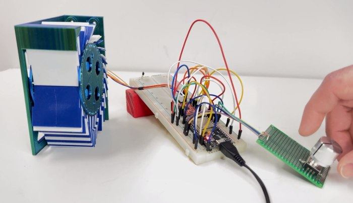
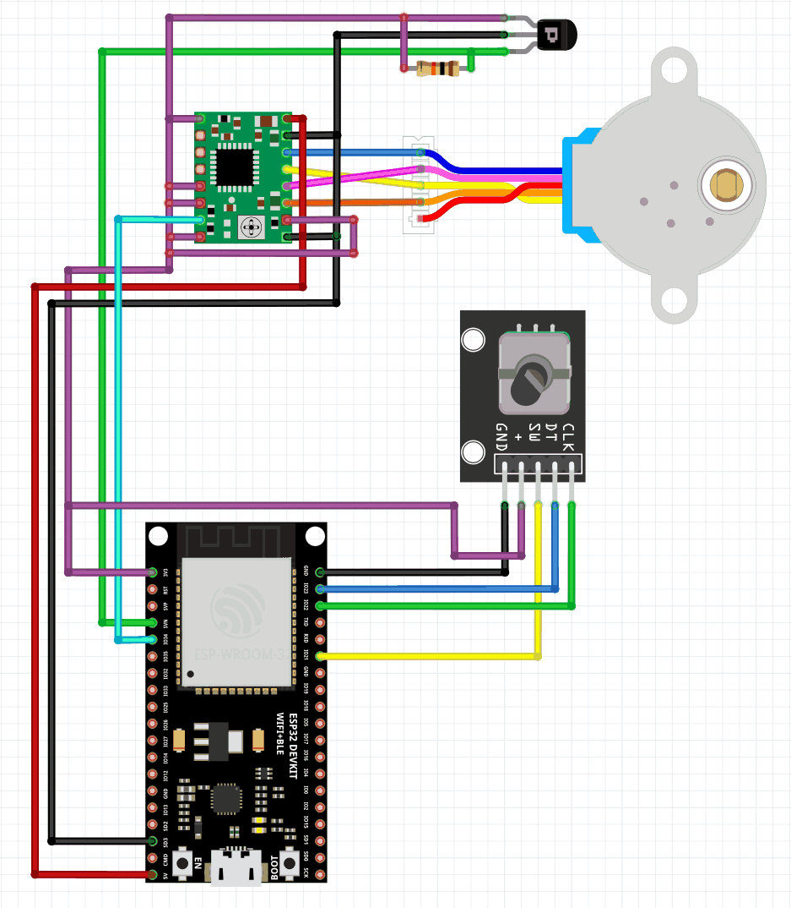
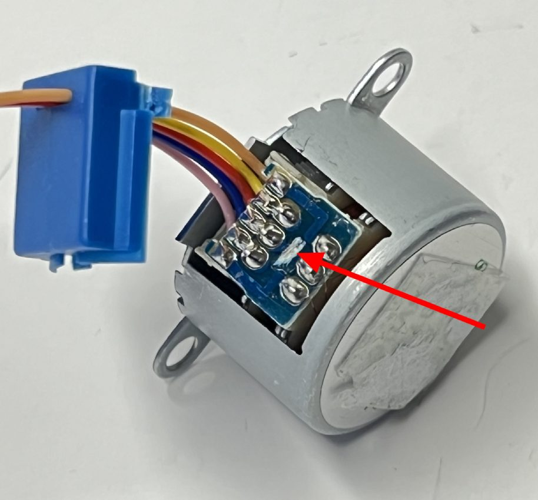

# esp32-splitflap-rotarycontrol
* Split-Flap Display Prototype Controlled by ESP32 and a Rotary Encoder

* This is custom software for this 3d printed split flap display:
** https://github.com/Dave19171/split-flap

# Libraries
* Due to this issue: https://github.com/me-no-dev/ESPAsyncWebServer/issues/1089
* * Use patched async webserver from here: https://github.com/me-no-dev/ESPAsyncWebServer/issues/1089

# Uploading
* Using Arduino IDE v1.8.19 to make LITTLEFS and ESP32 OTA updates a little easier
* * https://randomnerdtutorials.com/esp32-ota-over-the-air-arduino/
* * https://github.com/earlephilhower/mklittlefs
* * * https://randomnerdtutorials.com/install-esp8266-nodemcu-littlefs-arduino/

# Wiring Diagram

# Stepper Motor Modification
* For the motor to be driven by the A4988 driver you must modify the motor from unipolar to be bipolar.
* * Pop off the blue cover and scrape away the trace from the red wire in the middle

